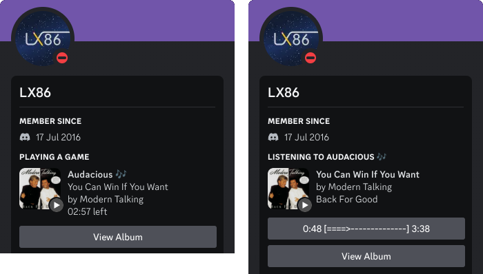

# audacious-plugin-rpc
A Discord Rich Presence plugin for the Audacious music player!  
Fork of https://github.com/darktohka/audacious-plugin-rpc



# Usage
1. Download the current release from the [releases page](https://github.com/Kenny-Hui/audacious-plugin-rpc/releases).
2. Extract `libaudacious-plugin-rpc.so` into the folder `/usr/lib/audacious/General/`.
3. Open Audacious, go to Settings > Plugins and enable the `Discord RPC` plugin.

# Changes/Features
- "Listening To" status (Toggleable) (See [Notes](#notes))
- Display current Album and Album Art (Fetched from Musicbrainz)
- View Album button (Link to Musicbrainz album)
- Countdown timer (See [Notes](#notes))
- **Some settings like Album Art are off by default, please configure in Plugin Settings before use**

# Notes
The details displayed in **Playing** and **Listening to** status may differs with each pros and cons of their own:  
**Playing status**
- (+) Real-time countdown until song finishes (Works with __TimeBarAllActivities__ plugin if using [Vencord](https://github.com/Vendicated/Vencord))
- (-) Album name only displayed when hovering on the album art
- (-) You wouldn't play a music player, the music player plays you

**Listening to status**
- (+) Album name displayed in the 3rd line, hovering on the album art also shows the name
- (+) "Listening to" makes 10x more sense
- (-) No countdown timer (An ASCII time bar is used with a button instead, but it has lower/unreliable update frequencies)

# Compilation
1. Clone the repository.
2. Compile and install the plugin:
```
mkdir build
cd build
cmake ..
make install
```
